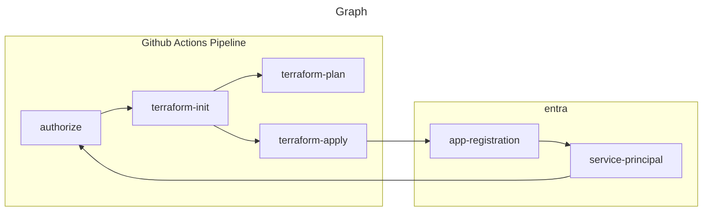

## Übersicht

Entra ID wird für dieses Projekt für folgende Dienste verwendet:

- OpenID Connect
- oAuth2.0 
- Service Principals

### Ziel

Um meine Pipelines mit [Github Actions](../Umsetzung/2vug-github-actions.md) zu verwenden und vorallem für Terraform als Backend benutzen kann, muss ich die Nutzung der Software als Applikation in Entra ID identifizieren und authorisieren. 

### Dienst

Ich möchte die für die Pipeline eingesetzte Terraform Konfiguration verwenden und gleichzeit mein State File von überall sicher erreichbar sein sollte, wird auf einen [Service Principal](https://learn.microsoft.com/en-us/entra/identity-platform/app-objects-and-service-principals) gesetzt. Dies ermöglicht es uns dem Service Principal, welches als Identität für die Pipeline Runner dient und über Azure Rollen und Entra Rollen mit den nötigsten Berechtigungen ausgestattet wird, welche nötig sind um Resourcen erstellen zu können.

### Ausführung

Im Code unter [github.tf](https://github.com/migueltinembart/tincloud-infrastructure/blob/main/az/shared/github.tf) können die Details zur Umsetzung abgeschaut werden.

In der Abbildung ist zu sehen dass Terraform mit Informationen von Entra ID sich authorisieren müsste. Dies Bedarf bei OpenID Connect eine ´client-id´, ´tenant-id´ und ein ´client-secret´. Diese konnte ich noch mit meiner Owner Rolle Erstellen, wird aber zukünftig über den Service Principal mit Terraform interagiert.

Weitere Details zur Ausführung findest du unter [Cloudflare Pages](../Umsetzung/2vug-github-actions.md).
