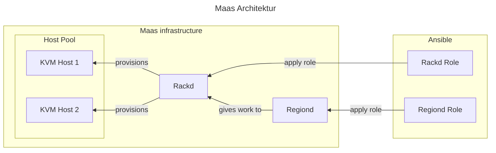
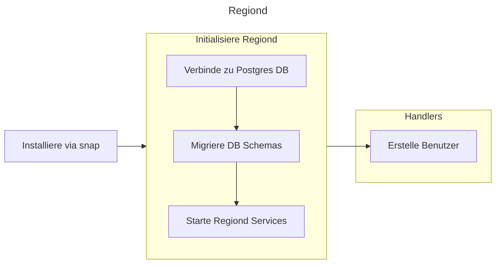
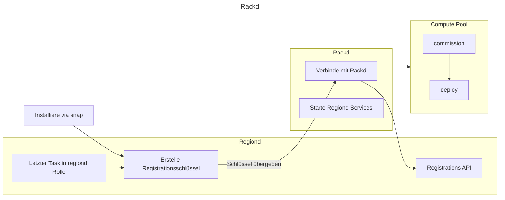

---

title: Maas Controller
created by: Miguel Tinembart
created at: 2024-07-03 00:00:00 +0200 CEST
tags:
  - Ansible
  - semesterarbeit
  - IAC
---

## Verwendete  Mittel

Die folgenden Controller werden für MAAS benötigt und dementsprechend wurden Rollen in Ansible erstellt.

- [MAAS Region Controller](https://github.com/migueltinembart/maas/tree/main/roles/regiond)
- [MAAS Rack Controller](https://github.com/migueltinembart/maas/tree/main/roles/rackd)

## Ziele

Die Rollen müssen folgende Kriterien erfüllen:

- [x] Anhand der Architektur des Systems die richtige Installation vornehmen (AMD64, ARM64, etc.)
- [x] Listen aufnehmen damit Tasks iterierbar sind
- [x] Benutzer erstellen und berechtigen können
- [x] Eine Datenbank anlegen
- [x] Konfigurationen an Files vornehmen (z.B. pg_hba.conf)
- [x] Mittels Handler bestimmte Tasks nur bei Änderungen vornehmen können.

## Umsetzung

Mehrere Rechner und Rechner sind nötig um die Installation sämtlicher Komponenten für MAAS richtig zu verwenden. Eine Postgresql Datenbank wird benötigt und die beiden benötigten Controller müssen bereitgestellt werden können um ein Netzwerk an Rechnern provisionieren zu können.



### Ansible

Für Ansible wurden 2 Rollen im [MAAS Repository](https://github.com/migueltinembart/maas) bereitgestellt. Zusätzlich wurden noch optionale Rollen erstellt, welche die Initialisierung noch vereinfachen sollten. Diese Rollendefinitionen wurden gemacht:

- [regiond](./ko63-maas-controller.md#regiond-rolle)
- [rackd](#rackd-rolle)
- [regiond_rackd](https://github.com/migueltinembart/maas/tree/main/roles/region_rackd)
- [maas-api](https://github.com/migueltinembart/maas/tree/main/roles/maas-api)

Die ersten beiden Rollen sind klar für einzelne Deployments eines entsprechenden Controllers zuständig. Ausserdem wurde eine gebündelte Rolle erstellt, welche beide Rollen gleichzeitig für simple Deployments auf einem Rechner erstellt. Die maas-api Rolle macht initiale Konfigurationseinstellungen und generiert einen API-Schlüssel. Diesen API-Schlüssel benötigen wir für die Erstellung von Instanzen mittels Terraform für [self-hosted Github Runner](./zx3v-self-hosted-runner.md).

#### Regiond Rolle

Regiond durchläuft folgende Tasks um einen Regiond Controller zu erstellen:



Für die Umsetzung dieser Idee werden Tasks und Handlers definiert und welche diese Abläufe reflektieren. 

##### Vars

```yaml
regiond_vars:
  db:
    user: "{{ maas_db_user }}"
    password: "{{ maas_db_password }}"
    address: "{{ maas_db_address }}"
    port: "{{ maas_db_port }}"
    name: "{{ maas_db_name }}"
  maas:
    channel: 3.4/stable
    fqdn: "{{ ansible_fqdn }}"
    user:
      name: "{{ maas_admin_user }}"
      password: "{{ maas_admin_password }}"
      email: "{{ maas_admin_email }}"

```

Die Variabeln werden in einem `dictionary` zusammengefasst und umgschliessen die wichtigsten Abhängigkeiten zur Datenbank, die Version der MAAS Installation oder dem initialen User.

##### Handlers

Um diesen Vorgang nur bei der Erstinstallation zu durchlaufen, wird dieser als Handler abgelegt. Darum wird der Benutzer nur explizit dann erstellt, wenn die Initialisierung beim ersten Durchlauf eine Änderung für Ansible darstellt.

Mittels Templating Strings werden die benötigten Userinformationen direkt in das Kommando hineingefügt. 

```yaml
- name: Create user for maas
  ansible.builtin.command: >
    maas createadmin --username={{ maas_admin_user }}
                     --password={{ maas_admin_password }}
                     --email={{ maas_admin_email }}
  become: true
  changed_when: false
```

##### Tasks

Zuerst wird die Installation mittels der Variable `regiond_vars.maas.channel` definierten Version via snap installiert. Mit dem Task `Initialize Maas Region Controller` wird darauf geachtet ob das File unter `/var/snap/maas/current/regiond.conf` erstellt wurde, denn dies ist ein Zeichen für einen initialisierten Regiond bei einer snap installation. Bei einem zweiten Durchlauf würde der Initialisierungsschritt übersprungen werden. 

Zuletzt wirt der API-Schlüssel für den Benutzer erstellt/eingelesen und als Variable in Ansible für Outputs verwendet.

```yaml
- name: Install Maas Region Controller with snap
  community.general.snap:
    name: maas
    classic: true
    state: present
    channel: "{{ regiond_vars.maas.channel }}"

- name: Initialize Maas Region Controller
  ansible.builtin.command: >
    maas init region
    --database-uri
    postgres://{{ regiond_vars.db.user }}:{{ regiond_vars.db.password }}@{{ regiond_vars.db.address }}:{{ regiond_vars.db.port }}/{{ regiond_vars.db.name }}
    --maas-url http://{{ inventory_hostname }}:5240/MAAS
  become: true
  notify: Create user for maas
  args:
    creates: "{{ regiond_conf_file }}"

- name: Register api key
  ansible.builtin.shell: >
    maas apikey --username={{ regiond_vars.maas.user.name }}
  register: api_key
  changed_when: false
```

#### Rackd Rolle

Die detaillierte Spezifikation findet man im Ordner [rackd](https://github.com/migueltinembart/maas/tree/main/roles/rackd).


Rackd durchläuft folgende Tasks um einen Rackd Controller zu erstellen:



Für die Umsetzung dieser Idee werden Tasks und Handlers definiert und welche diese Abläufe reflektieren. 

##### Vars

```yaml
rackd_vars:
  maas:
    channel: 3.4/stable
    user:
      name: "{{ maas_admin_user }}"
      password: "{{ maas_admin_password }}"
      email: "{{ maas_admin_email }}"
```

Die Variabeln werden in einem `dictionary` zusammengefasst.

##### Tasks

Zuerst wird die Installation mittels der Variable `regiond_vars.maas.channel` definierten Version via snap installiert. Mit dem Task `Initialize Maas Region Controller` wird darauf geachtet ob das File unter `/var/snap/maas/current/regiond.conf` erstellt wurde, denn dies ist ein Zeichen für einen initialisierten Regiond bei einer snap installation. Bei einem zweiten Durchlauf würde der Initialisierungsschritt übersprungen werden. 

Zuletzt wirt der API-Schlüssel für den Benutzer erstellt/eingelesen und als Variable in Ansible für Outputs verwendet.

```yaml
- name: Register variable within regiond
  ansible.builtin.shell: >
    maas apikey --username={{ rackd_vars.maas.user.name }}
  delegate_to: "{{ groups['regiond'][0] }}"
  register: api_key

- name: Install Maas Rackd Controller with snap
  community.general.snap:
    name: maas
    classic: true
    state: present
    channel: "{{ rackd_vars.maas.channel }}"

- name: Check if maas is initialized
  ansible.builtin.command: >
    maas status
  register: maas_status
  changed_when: maas_status.rc != 0
  ignore_errors: true

- name: Initialize Maas Rack Controller
  ansible.builtin.command: >
    maas init rack
    --maas-url http://{{ groups['regiond'][0] }}:5240/MAAS
    --secret {{ api_key.stdout }}
  become: true
  when: maas_status.rc != 0
  notify: Create user for maas
  timeout: 60

```
## Einsatz

Um die Rolle nutzen zu können wird in einem site.yaml die Rolle einem play in diesem Playbook zugewiesen. Anhand der Group Vars werden die Variabeln welche standardmässig für die regiond und rackd Hostgruppen definiert sind eingesetzt und können von Hostvars überschrieben werden. 

Ein entsprechener Eintrag für das Inventory kann wie folgt aussehen:

```yaml
# inventory/hosts.yaml
all:
  vars:
    ansible_connection: ssh
    ansible_ssh_user: ansible
    ansible_python_interpreter: /usr/bin/python3
    ansible_common_remote_group: ansible
  children:
    regiond:
      hosts:
        regiond.giswil.tincloud.local:
          ansible_host: 192.168.10.2
    rackd:
      hosts:
        rackd.giswil.tincloud.local
          ansible_host: 192.168.10.3
```

Ein Beispiel-Inventory steht euch hier zur Verfügung: [inventory](https://github.com/migueltinembart/maas/tree/main/inventory)

Die site.yaml dient als Einstiegspunkt für Ansible um Tasks in Folge durchzuarbeiten. Alle zusätzlichen Rollen werden einem Play zugewiesen.

```yaml
- name: Apply regiond role
  hosts: regiond
  become: true
  vars_files:
    - group_vars/regiond.yaml
  roles:
    - regiond

- name: Apply rackd role
  hosts: rackd
  become: true
  vars_files:
    - group_vars/rackd.yaml
  roles:
    - rackd

- name: Apply rack+region role
  hosts: regiond_rackd
  become: true
  vars_files:
    - group_vars/regiond_rackd.yaml
  roles:
    - region_rackd
```

### Resourcen

Folgende Resourcen sind zur Umsetzung eingesetzt worden:

- [cloudflare_pages_project](https://registry.terraform.io/providers/cloudflare/cloudflare/latest/docs/resources/pages_project)
- [cloudflare_pages_domain](https://registry.terraform.io/providers/cloudflare/cloudflare/latest/docs/resources/pages_domain)
- [cloudflare_record](https://registry.terraform.io/providers/cloudflare/cloudflare/latest/docs/resources/record)
- [cloudflare_api_token](https://registry.terraform.io/providers/cloudflare/cloudflare/latest/docs/resources/api_token)

