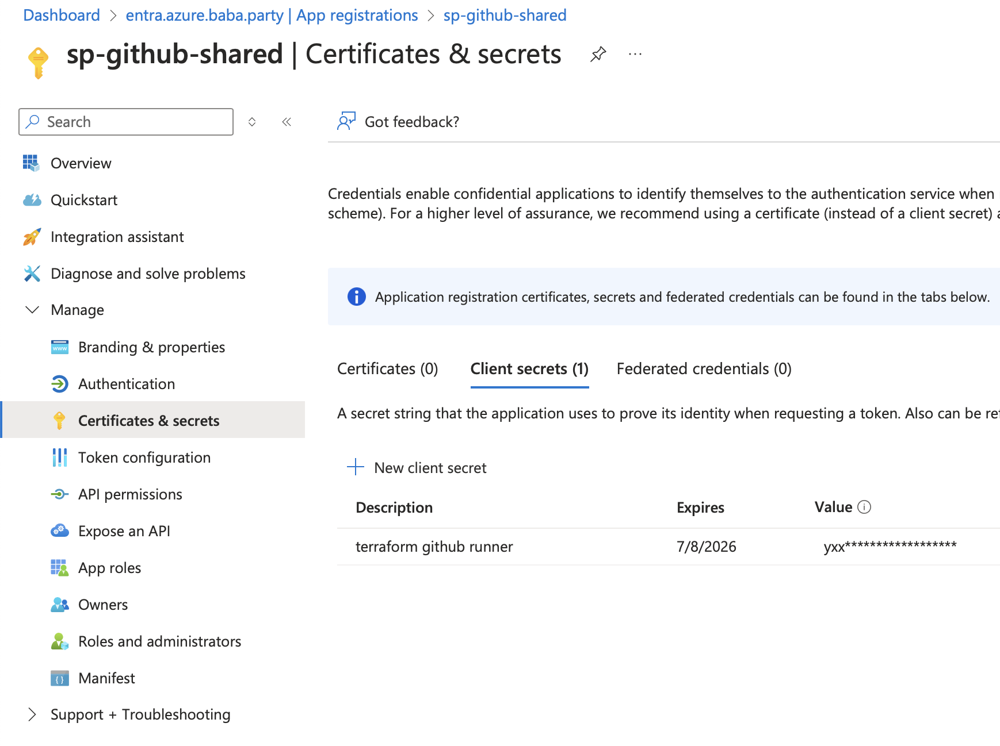
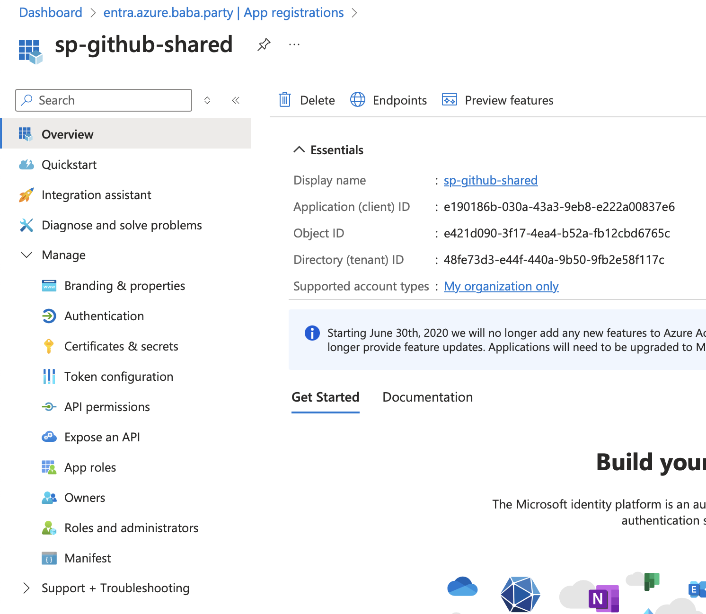

## Verwendete Mittel

Folgende Mittel sind für die Implementation in dieser Umsetzung zum Einsatz gekommen:

- [Github Actions](./2vug-github-actions.md)
- [Tincloud Infrastructure Repository](https://github.com/migueltinembart/tincloud-infrastructure)

## Ziele

Folgende Ziele müssen erfüllt werden:

- [ ] Dienste wie Pipelines nach bestem Gewissen authorisieren gewisse Änderungen an der Infrastruktur zu machen
- [ ] Backend für Terraform mit Entra ID authorisieren

## Umsetzung

Entra ID mit OpenID Connect und oauth2.0 stellt die Basis für die Authentifizierung und Authorisierung dar. Um somit Berechtigunen an Service Principals zu erteilen muss die Applikation in Entra zuerst erstellt werden.

Nach der Erstellung der App Registration können die ersten wichtigen Infos ausgelesen werden:



Nach der Registration können die Daten zur Authentifizerung der Applikation mittels OpenID Connect im Entra Portal ausgelesen werden und als Secret in die Pipeline eingeführt werden.



### Terraform

Die gesamte Application Registration mitsamt Berechtigungserteilung findet im Terraform statt. Um Github als Applikation mit der Pipeline authorisieren zu können, wurden alle nötigen Resourcen und Verbindungen im File `github.tf`. 

```tf
locals {
  github_roles = [
    "Privileged Role Administrator",
    "User Administrator"
  ]
}

data "azurerm_subscription" "top-level" {
  for_each        = toset(var.subscription_ids)
  subscription_id = each.value
}

data "azuread_user" "owner" {
  user_principal_name = var.owner
}

resource "azuread_application" "github" {
  display_name            = "sp-github-shared"
  description             = "Service Principal for Github"
  owners                  = [data.azuread_user.owner.object_id]
  prevent_duplicate_names = true
}

resource "azuread_service_principal" "github" {
  account_enabled = true
  client_id       = azuread_application.github.client_id
  tags            = ["github"]
  owners          = [data.azuread_user.owner.object_id]
}

resource "azuread_directory_role" "role" {
  for_each     = toset(local.github_roles)
  display_name = each.value
}

resource "azuread_directory_role_assignment" "github_role_assignment" {
  for_each            = toset(local.github_roles)
  principal_object_id = azuread_service_principal.github.object_id
  role_id             = azuread_directory_role.role[each.value].template_id
}

resource "azurerm_role_assignment" "github" {
  for_each             = data.azurerm_subscription.top-level
  principal_id         = azuread_service_principal.github.object_id
  scope                = each.value.id
  role_definition_name = "Contributor"
}
```

In diesem Fall ist zu sehen dass folgende Resourcen wie folgt aufgebaut sind:

- Die Rolle soll auf alle in der Variable `var.subscription_ids` definierten **Azure Subscriptions** angewendet werden. 
- Es wird die Applikation mitsamt Service Principal erstellt
- Es werden mehrere Rollen auf dem Principal angewandt

### Einsatz

Im [tincloud Infrastructure Repository](https://github.com/migueltinembart/tincloud-infrastructure) kann im Ordner `az/shared` das main.tf initialisiert werden. 

```hcl
# az/shared
cd global/shared
terraform init -backend-config backend.hcl
```

Passe das `.tfvars`-file an und übergib es an terraform für plan oder apply

```hcl
terraform plan -var-file prod.tfvars
terraform apply -var-file prod.tfvars
```

### Resourcen

Folgende Resourcen sind zur Umsetzung eingesetzt worden:

- [azuread_application](https://registry.terraform.io/providers/hashicorp/azuread/latest/docs/resources/application)
- [azuread_service_principal](https://registry.terraform.io/providers/hashicorp/azuread/latest/docs/resources/service_principal)
- [azuread_directory_service_role](https://registry.terraform.io/providers/hashicorp/azuread/latest/docs/resources/directory_role)
- [azuread_directory_role_assignment](https://registry.terraform.io/providers/hashicorp/azuread/latest/docs/resources/directory_role_assignment)
- [azurerm_role_assignment](https://registry.terraform.io/providers/hashicorp/azurerm/latest/docs/resources/role_assignment)
