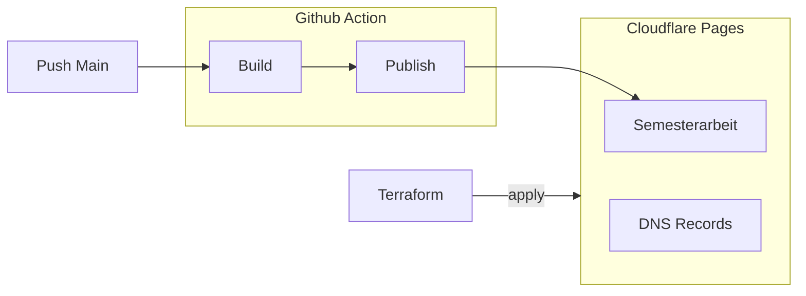

---

title: Cloudflare Pages
created by: Miguel Tinembart
created at: 2024-07-06 00:00:00 +0200 CEST
tags:
  - inbox
  - terraform
  - cloudflare
---

## Verwendete Mittel

Folgende Mittel sind für die Implementation in dieser Umsetzung zum Einsatz gekommen:

- [cloudflare](https://www.cloudflare.com)
- [Github Actions](./2vug-github-actions.md)
- [Tincloud Infrastructure Repository](https://github.com/migueltinembart/tincloud-infrastructure)
- [development-environment Repository](https://github.com/migueltinembart/development-environment)
- [quartz v4 template](https://github.com/jackyzha0/quartz)

## Ziele

Folgende Ziele müssen erfüllt werden:

- [x] Soll allgemeine DNS Einstellungen für Cloudflare verwalten
- [x] Soll die Pages Infrastruktur für die Dokumentation bereitstellen

## Umsetzung

Zur Umsetzung dieser Ziele wird mit Terraform die Bereitstellung der Cloudflare Pages Umgebung, sowie sämtliche Einstellungen gewährleistet. Anschliessend wird über das  [development-environment Repository](https://github.com/migueltinembart/development-environment) bei jedem Push auf den Main Branch wird ein neuer Build mit meiner Markdown Dokumentation erzeugt und als diese Webseite auf Cloudflare Pages veröffentlicht. Für die Build Steps kommt Github Actions zum Zug.



Anhand der Abbildung soll vereinfacht der Ablauf der Prozesse dargestellt sein. Diese Art der Arbeit ermöglicht die Ansicht des Endprodukts innerhalb einer Minute nach einem Push auf den Main Branch auf Github.

### Terraform

Die Terraform Konfiguration erstellt wenige Resourcen um die Cloudflare Pages Umgebung bereitzustellen. Eine einfache Cloudflare Pages Umgebung beinhalten folgende Cloudflare Produkte oder Features:

- Ein Cloudflare Pages Projekt
  - Cloudflare Pages Domain
- CNAME Record zur Pages Domain

#### Pages Projekt

Mit nur 2 Resourcen hat man bereits eine einfache Cloudflare Pages Umgebung geschaffen. Ein Cloudflare Pages Projekt mitsamt der Domäne benötigt:

- Die Account ID der das Projekt zugewiesen wird
- einen Namen für das Projekt
- Einen Domänennamen

```tf
resource "cloudflare_pages_project" "development-environment" {
  account_id        = var.account_id
  name              = "development-environment"
  production_branch = "main"
}

resource "cloudflare_pages_domain" "docs_dev-env" {
  account_id   = var.account_id
  project_name = cloudflare_pages_project.development-environment.name
  domain       = "docs.dev-env.tincloud.tech"
}

```

#### DNS Records

Um DNS Records mit Cloudflare erstellen zu können, kann die [cloudflare_record](https://registry.terraform.io/providers/cloudflare/cloudflare/latest/docs/resources/record) verwendet werden. Um mehrere Records erstellen zu können, kann über eine `map` von records iteriert werden.

In diesem Beispiel wird der CNAME Record für die Domäne auf die veröffentlichte Domäne des Cloudflare Pages Projekts.

```tf
resource "cloudflare_record" "docs_dev-env" {
  zone_id = cloudflare_zone.tincloud_tech.id
  name    = cloudflare_pages_domain.docs_dev-env.domain
  value   = cloudflare_pages_project.development-environment.subdomain
  type    = "CNAME"
  ttl     = 1
  proxied = true
}
```

### Einsatz

Im [tincloud Infrastructure Repository](https://github.com/migueltinembart/tincloud-infrastructure) kann im Ordner `global/shared` das main.tf initialisiert werden. 

```hcl
# global/shared
cd global/shared
terraform init -backend-config backend.hcl
```

Passe das `.tfvars`-file an und übergib es an terraform für plan oder apply

```hcl
terraform plan -var-file prod.tfvars
terraform apply -var-file prod.tfvars
```

### Resourcen

Folgende Resourcen sind zur Umsetzung eingesetzt worden:

- [cloudflare_pages_project](https://registry.terraform.io/providers/cloudflare/cloudflare/latest/docs/resources/pages_project)
- [cloudflare_pages_domain](https://registry.terraform.io/providers/cloudflare/cloudflare/latest/docs/resources/pages_domain)
- [cloudflare_record](https://registry.terraform.io/providers/cloudflare/cloudflare/latest/docs/resources/record)
- [cloudflare_api_token](https://registry.terraform.io/providers/cloudflare/cloudflare/latest/docs/resources/api_token)

