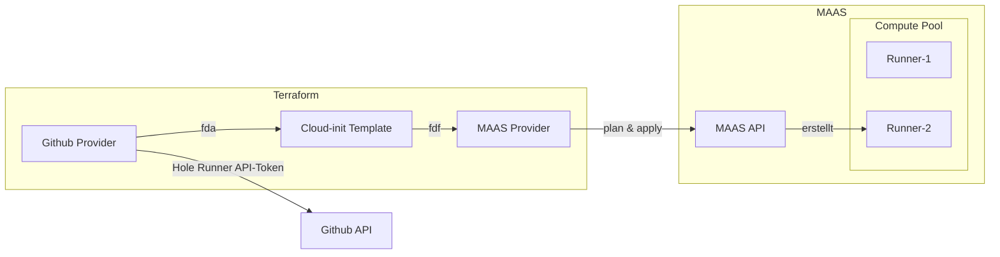

## Verwendete Mittel

Folgende Mittel sind für die Implementation in dieser Umsetzung zum Einsatz gekommen:

- [Github Actions](./2vug-github-actions.md)
- [Tincloud Infrastructure Repository](https://github.com/migueltinembart/tincloud-infrastructure)

## Ziele

Folgende Ziele müssen erfüllt werden:

- [ ] Anhand einer Liste von Repositories einen eigenen Runner auf meiner Infrastruktur erstellen lassen
- [ ] Die Runner sollen automatisiert erstellt werden können

## Umsetzung

Zur Umsetzung sind folgende Abhängigkeiten auf ihre Funktionsfähigkeit zu bedenken:

- [MAAS Infrastruktur](./koko63-maas-controller.md) muss bereitgestellt sein
- Maschinen für die Erzeugung der VMs müssen bereit sein

Die virtuellen Maschinen werden mit Terraform mithilfe des [MAAS Provider]() und des [Github Provider] bereitgestellt. Mit der Templating Funktionalität lässt sich praktischerweise ein [Cloud-init]() Template bereitstellen in welches man die Token zur Generierung von [self-hosted Runner]() für ein bestimmtes Repository herauslesen kann und für die Erzeugung jeder virtuellen Maschine ein eigenes user-data file für die Initialisierung übergibt.



Die Abbildung soll vereinfacht die Abhängigkeiten zwischen den verschiedenen Komponenten in diesem Deployment darstellen.

### Terraform

Terraform verbindet die verschiedene Abhängigkeiten miteinander und erstellt daraus die erwünschten Instanzen. Um die Abhängigkeiten einfacher zu definieren sind hier die wichtigsten Punkte zu dieser Konfiguration.

#### Variabeln

Ein Repo für einen Runner. Somit bedeutet dass, dass in der Definition eines solchen Runners die Informationen zum Repository eingeschlossen werden müssen. Im `variables.tf` sieht beschreiben wir einen **Runner**.

```tf
variable "pipeline_runners" {
  type = map(object({
    kvm_host  = string
    repo_owner = string
    runner_version = string
    github_repo = string
  }))
}
```

Mit diesen Informationen können nun mehrere Definitionen eines solchen Runners erstellt werden.


#### Instanzen

Die Instanzen müssen anhand der Variabeln erstellt werden können und dessen Werte auslesen können um mit nur einer Definition eines Runners gleich mehrere Instanzen erstellen zu können. Da wir als Definition eines Runners eine `map` für die Datenstruktur verwenden, können wir so viele Instanzen erstellen wie wir wollen. Die Integration mit Github erfolgt ganz einfach mit einem `data`-object um ein Token für die Runner Registration zu erlangen. 

Die Tokendefinition kann in der ´resource`-Definition angewendet werden. 

```tf
data "github_actions_registration_token" "github_runner" {
  for_each   = var.pipeline_runners
  repository = each.value.github_repo
}

resource "maas_instance" "runners" {
  for_each = var.pipeline_runners
  deploy_params {
    user_data = templatefile("${path.module}/cloud-init/github_runner/user_data.tftpl", {
      github_token   = data.github_actions_registration_token.github_runner[each.key].token
      github_repo    = each.value.github_repo
      owner          = each.value.repo_owner
      runner_version = each.value.runner_version
    })
    distro_series = "focal"
  }

  allocate_params {
    hostname      = each.value.kvm_host
    min_cpu_count = 1
    min_memory    = 2048
  }
  timeouts {
    delete = "1m"
  }
  lifecycle {
    ignore_changes = [
      deploy_params["user_data"]
    ]
  }
}
```

#### Provider

Die beiden Provider für meine [MAAS]() Infrastruktur und mein Github Konto werden im `main.tf` definiert. Jeder Provider hat noch seinen eigenen `provider`-Block. Die benötigten Informationen werden, mit Variabeln ergänzt.

```
terraform {
  required_providers {
    maas = {
      source  = "canonical/maas"
      version = "2.3.0"
    }
    github = {
      source  = "integrations/github"
      version = "6.2.0"
    }
  }
  backend "azurerm" {}
}

provider "maas" {
  api_version = "2.0"
  api_url     = var.maas_api_url
  api_key     = var.maas_api_key
}

provider "github" {
  token = var.github_token
}

```

### Einsatz

Im [tincloud Infrastructure Repository](https://github.com/migueltinembart/tincloud-infrastructure) kann im Ordner `giswil/shared` das main.tf initialisiert werden. 

```hcl
# giswil/shared
cd giswil/shared
terraform init -backend-config backend.hcl
```

Passe das `.tfvars`-file an und übergib es an terraform für plan oder apply

```hcl
terraform plan -var-file prod.tfvars
terraform apply -var-file prod.tfvars
```

### Resourcen

Folgende Resourcen sind zur Umsetzung eingesetzt worden:

- [cloudflare_pages_project](https://registry.terraform.io/providers/cloudflare/cloudflare/latest/docs/resources/pages_project)
- [cloudflare_pages_domain](https://registry.terraform.io/providers/cloudflare/cloudflare/latest/docs/resources/pages_domain)
- [cloudflare_record](https://registry.terraform.io/providers/cloudflare/cloudflare/latest/docs/resources/record)
- [cloudflare_api_token](https://registry.terraform.io/providers/cloudflare/cloudflare/latest/docs/resources/api_token)

