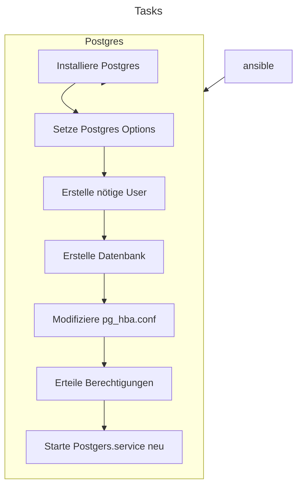
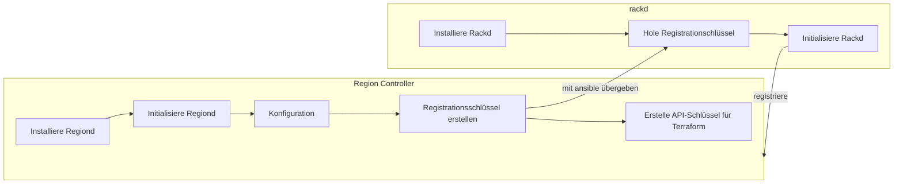

# Development Environment

## Projekt

### Module

- #IAC - Infrastructure as Code
- #MAAS - Metal As A Service
- #PRJ - Projektmanangement

### Dozenten

- Armin Dörzbach
- Marcel Bernet
- Philipp Rohr

### Termine

- Abgabedatum: 10.07.2024, 17:00 Uhr

### Projektrepositories

Folgende Repositories sind Bestandteil des Projekts:

- [Maas](https://github.com/migueltinembart/maas)
- [jinja-templates](https://github.com/migueltinembart/jinja-templates)
- [tincloud-infrastructure](https://github.com/migueltinembart/tincloud-infrastructure)

Jedes Repository bietet für die spezifische Anwendung ihre eigene Dokumentations- und Anleitungsstruktur und stehen allen zur Verfügung. Einzelne Repositories vereinfachen die Komposition und ermöglichen eine modulare Arbeitsweise.

## Einleitung

Eine Development Environment dient zur Vereinfachung von Entwicklungsprozessen in einer Organisation, für persönliche Projekte und kleinere Teams. Zu einer Development Environment gehören die Infrastruktur, Tools und Programme welche es sich zum Ziel machen, dem Entwickler oder dem Entwicklerteam eine Standardpalette an Vorgängen anzubieten um Applikationen zu deployen und die nötigen Resourcen zur Verfügung zu stellen um die Deployments zu vereinfachen. Da ich von einem cloud-nativen Ansatz in jeder Hinsicht ab Infrastruktur bis hin zur Applikation profitieren möchte, habe ich es mir zur Aufgabe gemacht die Planung, Umsetzung und die Dokumentation zu diesem Projekt für meine privaten Zwecke, aber auch für zukünftige Semesterarbeiten in die eigene Hand zu nehmen.

### Problem

Meine Infrastruktur besteht aus 2 Proxmox Intanzen, auf welcher diverse VMs laufen und mit Docker verschiedene Applikationen betreibe. Die meiste Konfiguration fand damals aber von Hand statt und die Überischt meiner Infratruktur somit nur durch mich nachvollziehbar. Sollte also irgendwann eine Komponente ersestzt werden müssen, z.B. durch einen Ausfall, kann ich nicht mehr gewährleisten, dass ich dieselbe Konfiguration für meine Applikationen wiederherstellen kann ohne dabei ein Backup herbeirufen zu müssen. 

### Aufgabe

Durch die Nutzung der Praktiken welche mit Infrastructure as Code, soll die Grundlegende Konfigurationen sämtlicher Infrastruktur und Applikationen vereinfachen und nachvollziehbar sein. Der Aufbau der verschiedenen Komponenten soll unabhängig aufbaubar sein und somit in mehrere Repositories gegliedert werden. Mit Terraform sollte die Erstellung von VMs einfacher zu erstellen sein. Ansible übernimmt die Erstellung der nötigen MAAS Komponenten wie Regiond und Rackd und Pipelines verschaffen mir die Möglichkeit automatisiert verschiedene Deployments zu verwirklichen ohne dass, Fehler auf die Infrastruktur überteten

### Projektmethode

Für das Projekt wird die Scrum Methode angewandt. Für dieses Projekt habe ich auf Github ein Project erstellen lassen um den Forttschritt des Projekts im Auge zu behalten.

### Ziele

Folgende Ziele sind für dieses Projekt zu erreichen:

- Einfache Erstellung von [MAAS Controller Instanzen](./Umsetzung/ko63-maas-controller.md#rackd-rolle)
- Verwaltbarkeit von VMs oder anderen Charakteristiken von MAAS Instanzen via Terraform
- Pushen von neuen Deployments via Pipelines
- Einfache Deployments mit cloud-init
- CloudFlare mittels Terraform in die Konfiguration einfliessen lassen
- Keine Secrets im Quellcode verwalten
- Daten verschlüsselt auf Quellcodeablegen, sofern nötig
- Dokumentation des Projekts als Static Webpage übergeben

Die Umsetzungen dieser Ziele werden in der Umsetzungsphase erwähnt.

## Umsetzung

Um die Umsetzung genauer zu beschreiben habe ich unter _Umsetzung_  im Explorer die detaillierten Informationen mit Code-Beispielen und genaueren Diagrammen. 

### MAAS Bereitstellung

Im [Architekturdiagram](./u0jx-architecture.md#abhängigkeiten) musste zuerst eine funktionierende MAAS Instanz erarbeitet werden. Die Erstellung des Repository für [MAAS](https://github.com/migueltinembart/maas) erforderte eine lokale geführte Installation einer solchen MAAS Instanz und Mithilfe dieser Information, konnten die nötigen Schritte für eine Installation mit Ansible in die entsprechenden Rollen eingeteilt werden. 

#### Postgres 

Zuerst muss eine [Postgres Datenbank](./Umsetzung/249n-postgresql.md) erstellt werden. Die Datenbank musste durch mich verwaltet und betreut werden können, die Erstellung eigener Secrets ermöglichen und wenn möglich auch für zukünftige andere Postgres Installation nutztbar sein. Mit der [Rollendefinition](./Umsetzung249n-postgresql.md) sind folgende Schritte eingesetzt worden um Postgres für einen [Region Controller](./Umsetzung/ko63-maas-controller.md#regiond-role) bereitzustellen.

Dank Ansible sind diese Schritte reproduzierbar gelöst und durch die Idempotenz wird sichergestellt, dass nichts geändert wird, solange das System den Anforderungen der Ansible Rolle entspricht.

Schlussendlich wurde eine Postgres Datenbank auf einem separaten System installiert operiert die Daten für meine MAAS API. 

#### Controller

Die jeweiligen Controller werden wie bei der Postgres Rolle auch als einzelne Rollen im selben Repository für MAAS definiert. 

- [Regiond]()
- [Rackd]()
- [Region & Rackd]()

Im Falle einer Neuinstallation der Controller kann man sich aussuchen ob man die Rollen separat oder zusammen als eine Rolle für sein Zielsystem verwenden möchte. Die Schritte für die Installation von MAAS variieren, da die Installationsschriite abhängig von der Installationsart von MAAS ist. MAAS lässt sich auf Ubuntu Systemem entweder via [apt]() oder [Snap]() installieren. Die Schritte mit apt haben mir nicht gepasst, da mit apt immer eine postgres Datenbank für den [Region Controller](./Umsetzung/ko63-maas-controller.md#regiond-rolle) mitinstalliert wird und damit initialisiert wird. Da ich die Datenbank selber bereitstellen wollte, habe ich mich auf die Installation mit **Snap** verlassen. Mit Snap wird nämlich noch ein Initialisierungsschritt benötigt, bei der man das zieldatenbanksystem direkt übergeben kann.

Die Schritte um beide Systeme als eine Einheit zu installieren beschreibt sich mit folgendem Diagramm:

Ein wichtiger Schritt bei der ganzen Implementation ist die Erstellung und die Übergabe des Registrationsschlüssel vom **Region Controller** zum [Rack Controller](./Umsetzung/ko63-maas-controller.md#rackd-rolle). Dies wird in Ansible durch die Erstellung einer Laufzeitvariable mit `register` erstellt und kann so für den rackd im selben Playbook wiederverwendet werden. 

Nachdem Durchlauf konnte ich mich bei der Weboberfläche mit anmelden und konnte mich dann um das provisionieren von physischen Maschinen kümmern.

#### Instanzen

Um mit der MAAS Infrastruktur etwas anfangen zu können, müssen noch die physischen Rechner mit der PXE-Boot Funktionalität des MAAS Rack Controllers gestartet und kommissioniert werden. Für diesen Schritt habe ich noch nicht mit Terraform angefangen, da dieser Prozess trotz allem, immer noch von Hand ausgeführt wird. Die Rechner starten sich bei mir leider immer noch nicht von alleine.

Trotzdem müssen einige andere Schritte noch eingeleitet werden. 

- DHCP muss konfiguriert und eingeschaltet werden für das von MAAS zu verwaltendende Netzwerk
- Ein separates Netzwerk muss für die Verwaltung der physischen MAschinen durch MAAS

Nachdem beide Konfigurationsschritte gemacht wurden konnzen die Instanzen im Web-GUI erstellt werden. Dabei erstellt man einen Instanz und erfasst die MAC-Adresse des zugehörigen Rechners. Nachdem Start des Rechner fängt die Provisionierung mit PXE an und man kann den Host als KVM-Host kommissionieren.

Sobald alle KVM-Host Instanzen erstellt wurden, konnte ich meine gewünschten [virtuellen Maschinen](./Umsetzung/zx3v-self-hosted-runner.md) mit Terraform erstellen. 

### Dokumentation

Die Dokumentation ist hier auf der Website ersichtlich. Um diese Webseite so bereitstellen zu können musste ich mich für einen Page-Hosting Provder entscheiden. Github Pages wäre zu einfach gewesen, also habe ich meinen bestehenden DNS Provider ausgewählt und mit Terraform und Github Actions auf meinen eigenen Runnern bereitstellen können.

Der Build Prozess für die statische Webseite anhand meiner Markdown Dokumentation kann mit jeglichen Markdown-to-static-webpage-Generator erstellt werden. Da ich aber nicht gerne Abhängigkeiten auf meinen Repos definiere habe ich die Markdown Dokumentation so sauber wie möglich gehalten. Von Github habe ich mir ein Template namens [Quartz](https://github.com/jackyzha0/quartz) geschnappt und klone das Projekt lediglich während des Builds mit Github Actions.

Die weiteren Details stehen [hier](./Umsetzung/nvbo-dokumentation.md)
