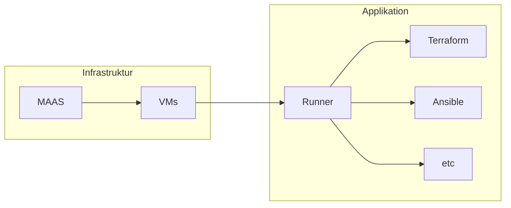
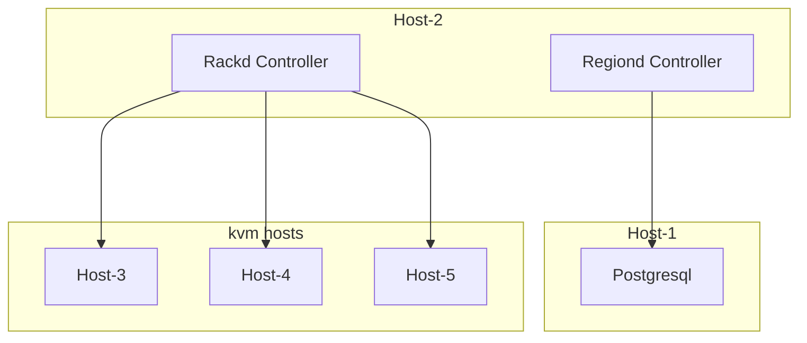

---

title: Architektur
created by: Miguel Tinembart
created at: 2024-07-01 00:00:00 +0200 CEST
tags:
  - PRJ

---

## Übersiht

Anhand der Abbildung stellen wir folgende Komponenten fest:

- Runners welche für Github Actions zur Verfügung stehen
- Ein Maas Region und Rack Controller verwalten Bare Metal Instanzen und virtuelle Maschinen
- Die Runners übernehmen Grundlegende Deployment Task

## Abhängigkeiten
Anhand dieser Graphe ist ersichtlich, dass zuerst die Infrastruktur bereitgestellt sein muss, bevor die Applikationen wie Runner und deren Jobs ausgerollt werden können. Der zentrale Fokus der Bereitstellung in diesem Projekt befasst sich mit der Bereitstellung der nötigen Komponenten der Infrastruktur.

### Applikationen

Folgende Applikationen und Dienste definieren die Grundlage für die Infrastruktureinheit:

| Name | Funktion | 
| --- | --- |
| #Postgreql | Datenbank für MAAS Regiond |
| #MAAS-Region-Controller | Stellt die API für REST & GUI für Bereitstellung zur Verfügung |
| #MAAS-Rack-Controller | Stellt Images für Instanzen bereit. DNS, DHCP, etc | 

Diese Applikationen übernehmen in der Konfiguration für Ansible ihre eigene Rollen und erlauben so die freie Verteilung ihrer Hosts nach Funktion.

#### Design

Mit Ansible sind Rollen für die entsprechende Applikation erstellt worden. So erlaubt es sich verschiedene Teilsysteme im gleichen System oder in verteilten Systemen in Betrieb zu nehmen.

> [!warning] Warnung
> Das Playbook und deren Rollen in diesem Projekt sind nicht für echte Productionzwecke mit redundanten oder horizontal skalierenden Systemen gedacht. Sie erlaubt lediglich die Erstellung von separierten Systemen mit ihrer eigenen Verantwortung.

#### Hardware

Folgende Hardware wird eingesetzt um die folgenden Rollen einzusetzen. Diese Entscheidung wurde in Bezug auf mein Budget an physischen Rechnern gemacht.

#### Konfiguration

Die Konfiguration der einzelnen Systeme übernimmt in diesem Design Ansible. Mit einem nach Wunsch definierten Inventoryfile können die entsprechenden Applikationen und die dafür nötige Konfiguration mit den Rollendefinitionen widerspiegelt werden. 

Die Erstellung der virtuellen Maschinen erfolgt durch Terraform. Die Bare Metal Instanzen werden von hand gestartet und über das graphische Interface bereitgestellt.
