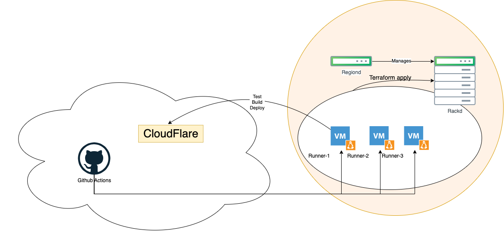
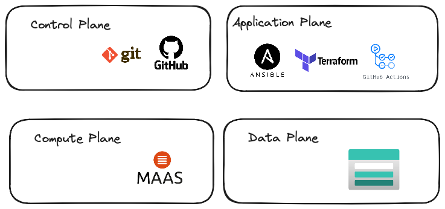
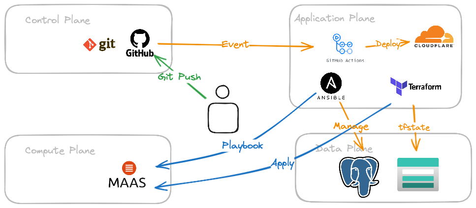

---

title: Architektur
created by: Miguel Tinembart
created at: 2024-07-01 00:00:00 +0200 CEST
tags:
  - inbox

---

## Architektur

Mithilfe von Github Actions auf selbergehosteten Runnern soll eine GitOps taugliche Umgebung definiert werden. Damit die Runner auf der Umgebung erstellt werden können, müssen VMs erstellt werden um die Aufgaben von Github Actions abarbeiten zu können. Die bereitstellung der virtuellen Maschinen übernehmen die von MAAS bereitgestellten Instanzen in einem Resource Pool.

### Inbetriebnahme

Mit Ansible werden die MAAS Controller Resourcen bereitgestellt und konfiguriert. Durch Terraform und manueller Handarbeit zum Starten und Integrieren der Maas Instanzen, können danach VMs provisioniert werden und einer bestimmten physischen Insatnz anhand von Charakteristiken wie starke CPU oder hoher RAM muss zum Einsatz.

Nachfolgend wird beschrieben wie die verschiedenen Systeme sich aufeinander verhalten: 

Die verwendeten Systeme werden in vier Ebenen kategorisiert:

- Data Plane
- Control Plane
- Application Plane
- Compute Plane

Mit dieser Aufteilung wird sichergestellt das die einzelnen Komponenten einfach zugeordnet werden können. 

### Abhängigkeiten

### Basisarchitektur

